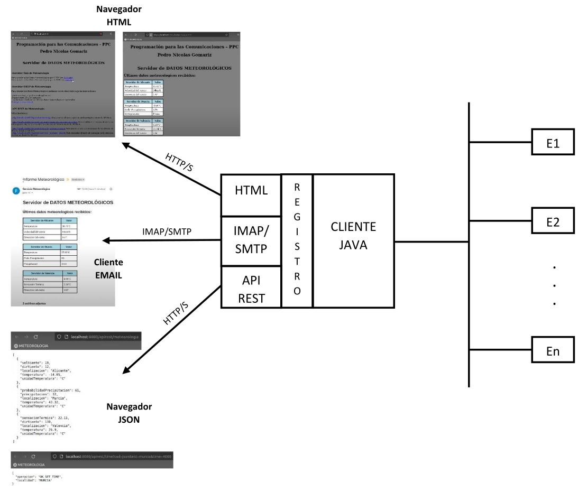
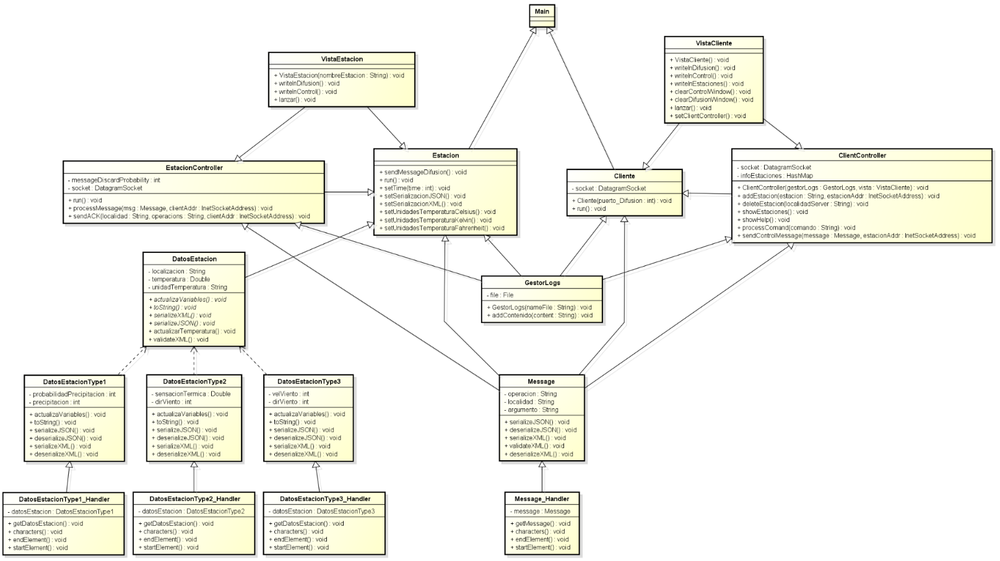
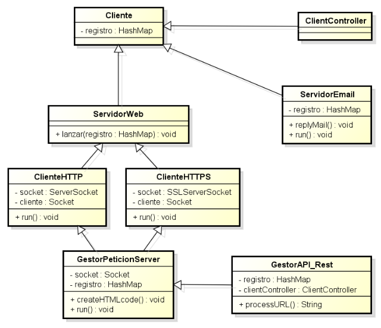
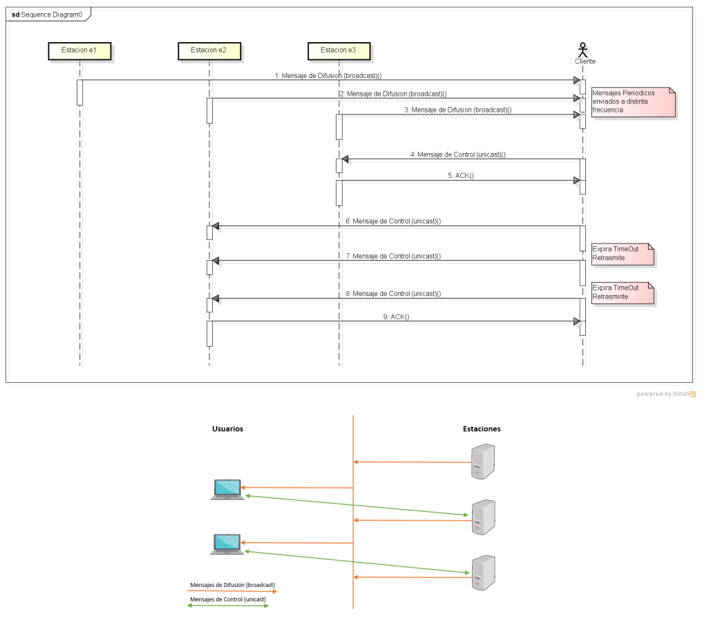
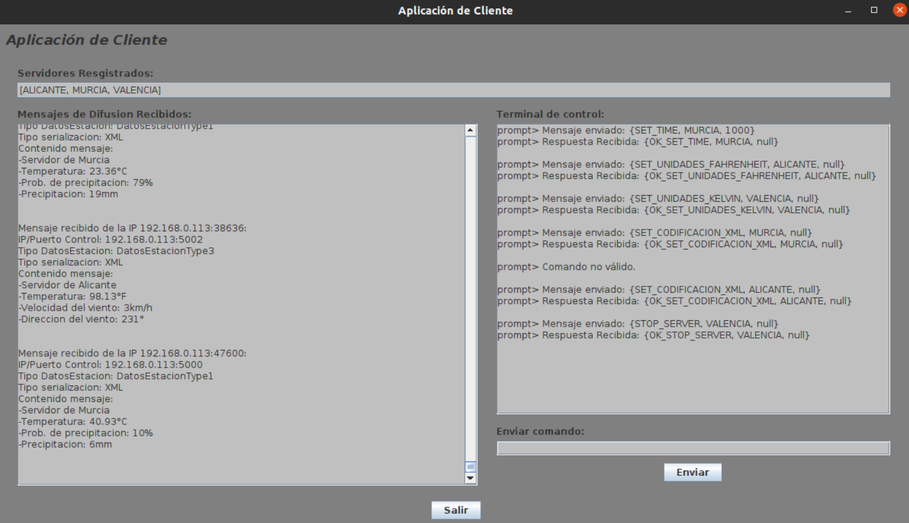
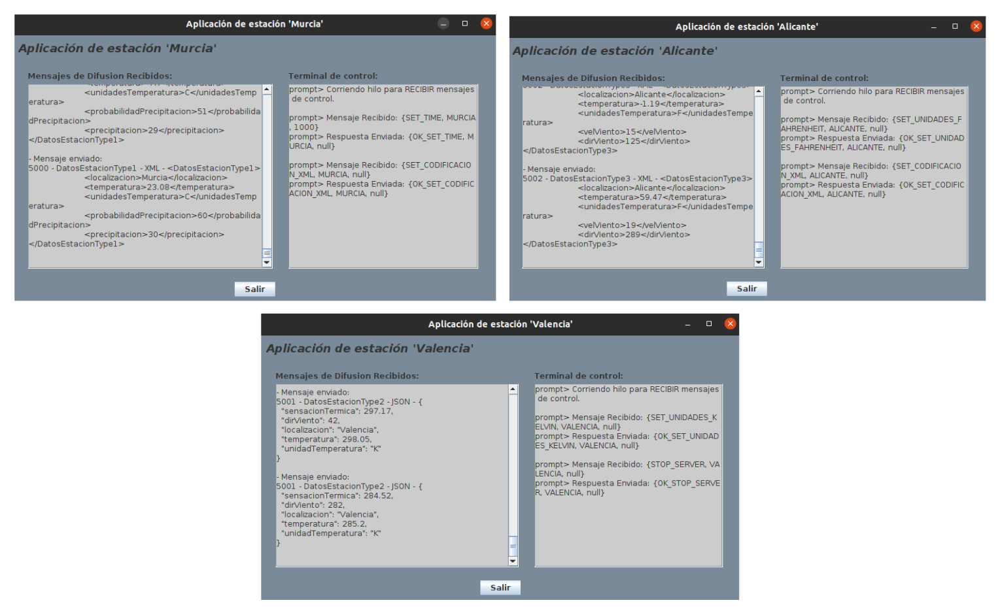
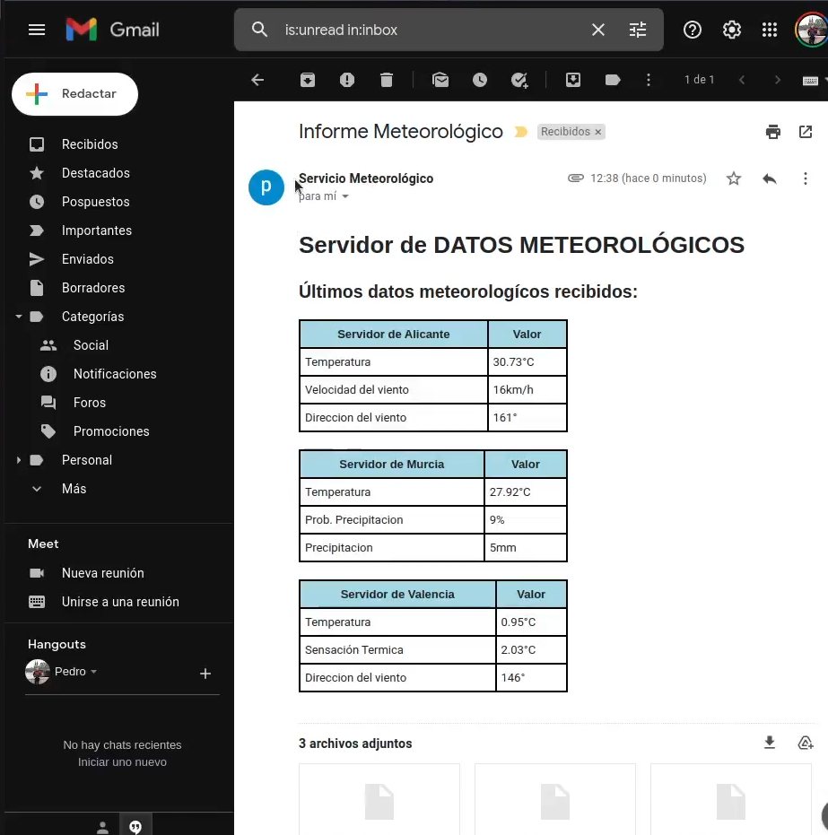

# MultiMeteoSys

Proyecto académico desarrollado en la asignatura **Programación para las Comunicaciones (PPC)** del Grado en Ingeniería Informática en la Universidad de Murcia. El objetivo es diseñar e implementar un sistema cliente-servidor completo y funcional, utilizando múltiples protocolos de red y tecnologías de comunicación.

Un cliente actúa como núcleo central del sistema, encargado de recibir mensajes UDP de difusión enviados por un conjunto de estaciones meteorológicas distribuidas. Estas estaciones simulan sensores reales generando datos ambientales como temperatura, sensación térmica, probabilidad de precipitación, precipitación acumulada, dirección y velocidad del viento. Cada estación emite estos valores a intervalos configurables, lo que permite simular un entorno meteorológico dinámico. El cliente procesa y almacena los últimos datos recibidos de cada estación, permitiendo su consulta o control posterior a través de distintos protocolos como HTTP, REST o correo electrónico.

- [📄 Documentación completa P2.](./doc/Memoria_PPC_P2.pdf)
- [📄 Documentación completa P3.](./doc/Memoria_PPC_P3.pdf)

## 🎯 Objetivo del proyecto

Desarrollar una aplicación cliente-servidor multihilo que permita:

- Almacenar los últimos valores meteorológicos recibidos desde distintas estaciones.
- Ofrecer acceso remoto a los datos mediante:
  - Navegador web vía HTTP/HTTPS (servicio HTML).
  - API REST para operaciones de consulta y control.
  - Envío y respuesta por correo electrónico utilizando IMAP y SMTP.
- Generar respuestas en HTML y JSON dinámicamente.
- Mantener una arquitectura modular y reutilizable basada en el trabajo de prácticas anteriores.

## 📐 Arquitectura general del sistema



## 🧬 Diagrama de clases





## 🔁 Diagrama de secuencia



## 📂 Estructura del proyecto

```
MultiMeteoSys/
│
├── doc/         # Documentación (memorias técnicas)
├── src/         # Código fuente Java
├── cert/        # Certificados X.509 y claves privadas
├── data/        # Archivos XML/JSON generados y recibidos
└── web/         # Archivos HTML del servicio web
```

## 🧩 Componentes del sistema


### Cliente

- Punto de entrada del sistema.
- Recibe mensajes de difusión UDP de las estaciones meteorológicas.
- Almacena los últimos valores recibidos en un `HashMap<String, DatosEstacion>` compartido.
- Interfaz gráfica desarrollada con Java Swing.

### Estación meteorológica

Simula sensores ambientales que generan datos meteorológicos como:

- Temperatura
- Sensación térmica
- Probabilidad de precipitación
- Precipitación acumulada
- Dirección y velocidad del viento

Características principales:

- Emite periódicamente tramas de difusión UDP al cliente.
- Recibe mensajes de control para modificar frecuencia, unidades o codificación (XML/JSON).
- Implementa procesamiento multihilo: un hilo para envío de datos y otro para recepción de comandos.
- Permite cambiar la codificación de datos entre XML y JSON en tiempo real.
- Responde con ACK al cliente tras recibir comandos correctamente, incluyendo reintentos en caso de pérdida de mensajes.
- Interfaz gráfica desarrollada con Java Swing.

### Servidor Web (HTTP/HTTPS)

- Accesible desde navegador.
- Permite:
  - Ver los últimos datos meteorológicos en `meteorologia.html`.
  - Acceder a un índice de servicios desde `index.html`.
  - Gestionar peticiones REST a través de URLs específicas.

### API REST

- Implementada sobre el mismo servidor web.
- Ofrece endpoints como:
  - `/apirest/meteorologia`: devuelve los últimos datos en JSON.
  - `/apirest/time?est=...&time=...`: cambia la frecuencia de emisión de una estación.
  - `/apirest/tempK?est=...`: cambia la unidad de temperatura.
  - [Ver más endpoints en la documentación.](./doc/Memoria_PPC_P3.pdf)

### Servidor Email (IMAP/SMTP)

- Revisa periódicamente (cada 15 segundos) correos no leídos con asunto `"meteorologia"`.
- Responde con:
  - Cuerpo del mensaje en HTML con los últimos datos.
  - Archivos adjuntos JSON, uno por cada estación.

## 💻 Capturas de pantalla

- **Interfaz de cliente**  
  

- **Interfaces de estaciones meteorológicas**  
  

- **Informe HTTP**  
  

- **Informe enviado por email**  
  

## 👤 Autor

- Pedro Nicolás Gomariz — pedro.nicolasg@um.es

Proyecto desarrollado como entrega final de las prácticas 2 y 3 de la asignatura **Programación para las Comunicaciones (PPC)** — Universidad de Murcia (curso 2021/2022).

Todos los derechos reservados © 2025.
